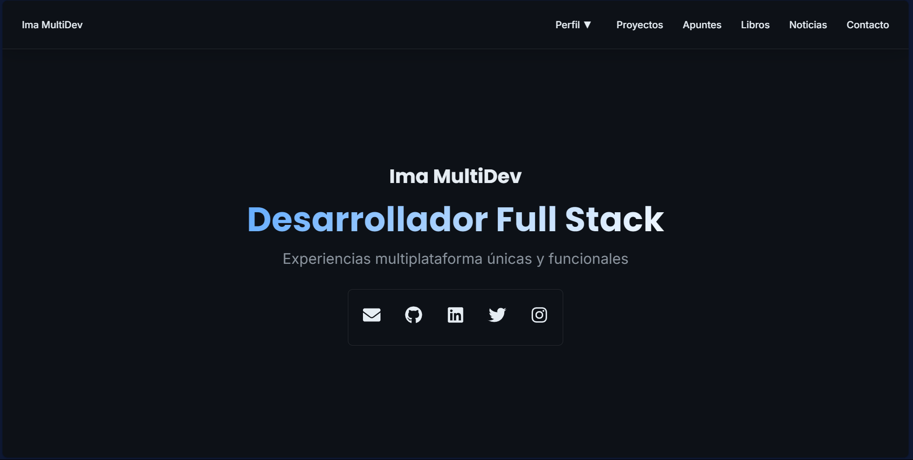

# Ima MultiDev Portfolio



## 🚀 Demo

[Ver Portfolio en vivo](https://imamultidev.dev/)

## 📝 Descripción

Portfolio profesional desarrollado con React y tecnologías modernas que muestra mi trabajo como desarrollador Full Stack. El sitio incluye secciones para proyectos, habilidades, experiencia, formación, recursos educativos y un blog de noticias tecnológicas.

## ⚡ Características

- Diseño responsive y moderno
- Animaciones fluidas con Framer Motion
- Modo oscuro por defecto
- Integración con APIs (GitHub, Dev.to)
- Sección de proyectos dinámica
- Biblioteca de recursos y libros
- Blog de noticias tecnológicas
- Formulario de contacto
- Optimización de rendimiento con lazy loading

## 🛠️ Tecnologías

- **Frontend:**
  - React 18
  - Vite
  - Emotion (Styled Components)
  - Framer Motion
  - React Router v6
  - React Icons

- **Estilado:**
  - CSS-in-JS con Emotion
  - Diseño responsive
  - Sistema de temas personalizado

- **Integraciones:**
  - GitHub API
  - Dev.to API
  - Netlify Forms

- **Optimización:**
  - Lazy Loading
  - Code Splitting
  - Optimización de imágenes
  - PWA ready

## 🚀 Instalación

1. Clona el repositorio:
```bash
git clone https://github.com/imamultidev/frontend.git
```
2. Instala las dependencias:
```bash
cd frontend
npm install
```
3. Inicia el servidor de desarrollo:
```bash
npm run dev
```
## 📁 Estructura del Proyecto
```plaintext
├── frontend/
│   ├── dist/
│   ├── node_modules/
│   ├── public/
│   ├── src/
│   │   ├── assets/
│   │   ├── components/
│   │   ├── context/
│   │   ├── hooks/
│   │   ├── pages/
│   │   ├── services/
│   │   ├── styles/
│   │   ├── App.css
│   │   ├── App.jsx
│   │   ├── index.css
│   │   ├── main.jsx
│   ├── .gitignore
│   ├── eslint.config.js
│   ├── index.html
│   ├── netlify.toml
│   ├── package-lock.json
│   ├── package.json
│   ├── README.md
│   ├── vite.config.js
```

## 🔧 Configuración

Para ejecutar este proyecto localmente, necesitarás crear un archivo `.env` con las siguientes variables:

```
VITE_GITHUB_TOKEN=tu_token_de_github
VITE_DEVTO_API_KEY=tu_api_key_de_devto
```

## 📱 Responsive Design

El portfolio está optimizado para todas las pantallas:
- Móvil: 320px - 480px
- Tablet: 481px - 768px
- Desktop: 769px+

## 🌐 Despliegue

El sitio está desplegado en Netlify con integración continua:
1. Cada push a `main` despliega automáticamente
2. Preview deployments en Pull Requests
3. Optimización automática de assets

## 🤝 Contribuir

Las contribuciones son bienvenidas. Por favor, abre un issue primero para discutir los cambios que te gustaría hacer.

## 📄 Licencia

Este proyecto está bajo la Licencia MIT - ver el archivo [LICENSE.md](LICENSE.md) para más detalles.

## 📬 Contacto

- Website: [imamultidev.dev](https://imamultidev.dev/)
- GitHub: [@kodebidean](https://github.com/kodebidean)
- LinkedIn: [Imanol Mugueta Unsain](https://www.linkedin.com/in/imanol-mugueta-unsain/)
- Twitter: [@KodeBidean](https://twitter.com/KodeBidean)
